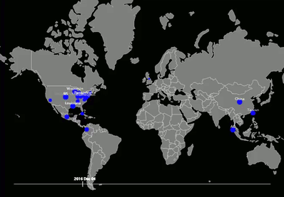

Twitter timeline entities recognition using D3 and Python
=========================================================

A few days ago I gathered about 17,000 Tweets (no retweets) from @realDonaldTrump, and I'm performing now entities recognition on the last 2,000.

It uses Python to scrape the Tweets (source not included in this Git) extract the data and perform the entities recognition (only places: countries, cities, etc.), and D3 to plot them.

